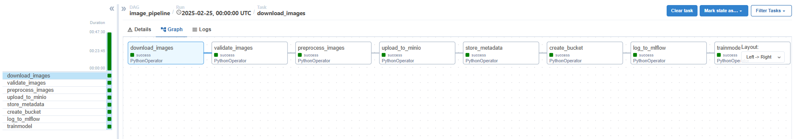
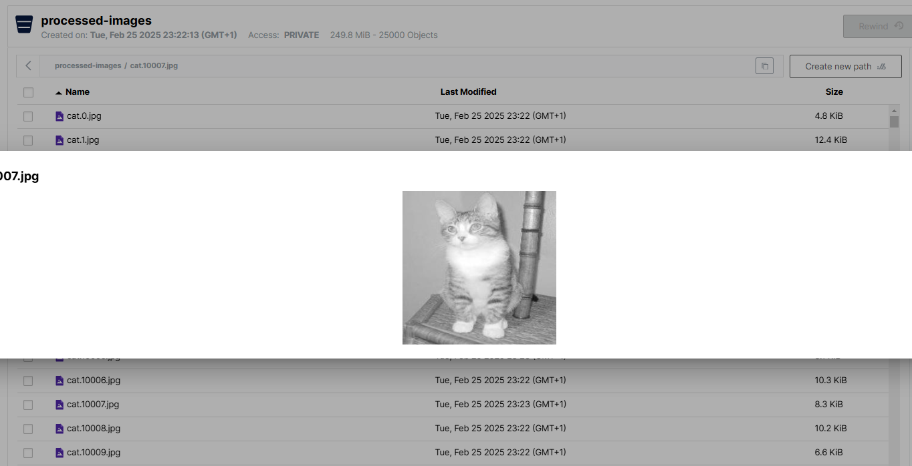
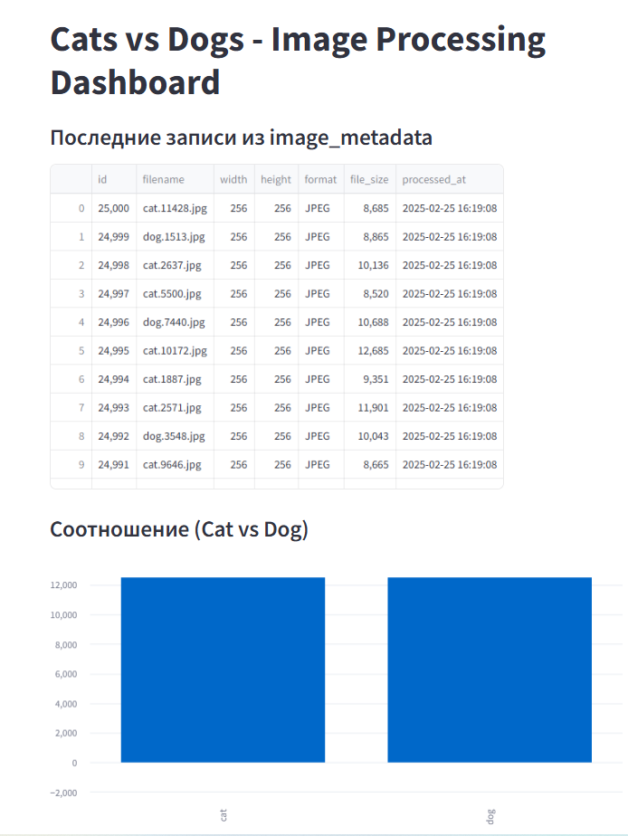
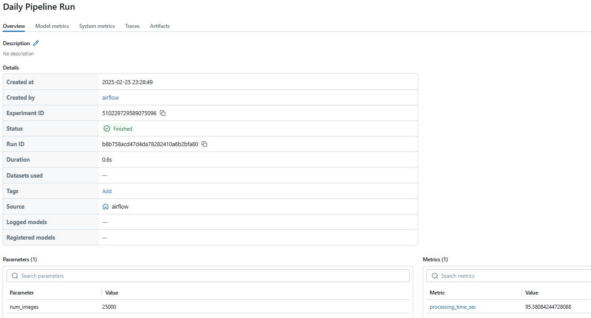
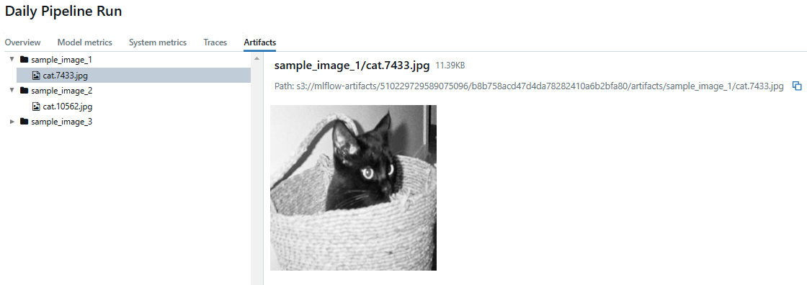
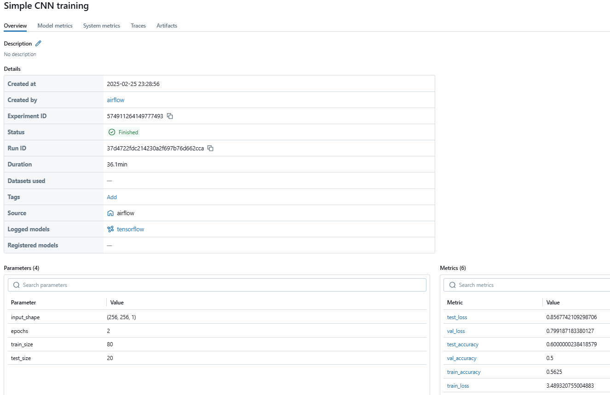
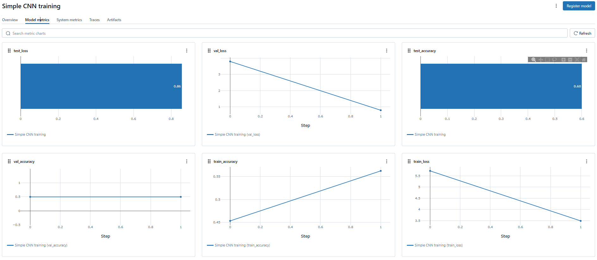

# Image Processing Pipeline with Airflow, MLflow, MinIO, PostgreSQL & Streamlit Dashboard

Этот проект представляет собой Docker-развернутый ETL-пайплайн для обработки изображений (Cats vs Dogs) [Источник](https://www.kaggle.com/competitions/dogs-vs-cats/data). В рамках проекта реализованы следующие этапы:

- **Extract:** Загрузка изображений из локальной директории
- **Validate:** Проверка корректности изображений (открываются ли они, соответствуют ли требованиям и т.п.)
- **Transform:** Предобработка изображений — изменение размера до 256x256, конвертация в градации серого и сохранение обработанных файлов
- **Load:** Загрузка обработанных изображений в MinIO и сохранение метаданных в PostgreSQL
- **Modeling:** Обучение простой CNN-модели для классификации изображений с использованием TensorFlow и логирование экспериментов в MLflow
- **Dashboard:** Интерактивная визуализация результатов обработки с помощью Streamlit

## Архитектура проекта

Проект состоит из нескольких контейнеров, каждый из которых отвечает за свою задачу:

- **PostgreSQL:** Хранение метаданных Airflow и MLflow
- **MinIO:** Хранилище для обработанных изображений и артефактов MLflow
- **Airflow:** Оркестрация пайплайна обработки изображений (DAG, операторы Python)
- **MLflow:** Tracking server для логирования экспериментов и моделей
- **Streamlit:** Дашборд для визуализации данных (распределение валидности, размеров файлов, соотношение классов)

## Структура проекта

```plaintext
├── airflow
│   ├── dags
│   │   │── image_pipeline.py         # Определение DAG для обработки изображений
│   │   └── scripts
│   │       ├── download_images.py        # Загрузка изображений из локальной директории
│   │       ├── data_validation.py        # Проверка корректности изображений
│   │       ├── preprocess_images.py      # Предобработка изображений (resize, grayscale, логирование времени)
│   │       └── ml_classification.py      # Обучение модели и логирование в MLflow
│   └── Dockerfile                    # Dockerfile для сборки образа Airflow
├── db
│   └── schema.sql                    # SQL схема для создания таблицы image_metadata
├── streamlit_app
│   ├── app.py                        # Приложение Streamlit для визуализации данных
│   ├── Dockerfile                    # Dockerfile для сборки образа Streamlit
│   └── requirements.txt                 
└── docker-compose.yml                # Основной файл для запуска всех контейнеров
```

# Предварительные требования

Убедитесь, что у вас установлены:
- **Docker**
- **Docker Compose**

# Инструкция по установке и запуску

## Клонирование репозитория

```bash
git clone <URL репозитория>
cd <название репозитория>
```

# Запуск проекта
Для сборки и запуска всех контейнеров выполните:

```bash
docker-compose up --build -d
```

Это запустит:

- **PostgreSQL на порту 5432**
- **MinIO на портах 9000 (API) и 9001 (веб-консоль)**
- **Airflow Webserver на порту 8080**
- **MLflow Tracking Server на порту 5000**
- **Streamlit Dashboard на порту 8501**


# Airflow

<figure>
  
  <figcaption>Процесс работы DAG</figcaption>
</figure>

# MinIO

<figure>
  
  <figcaption>Пример обработанного изображения в MinIO</figcaption>
</figure>

# Streamlit

<figure>
  
  <figcaption>Первая половина дэшбоарда в Steamlit</figcaption>
</figure>

<figure>
  
  <figcaption>Вторая половина дэшбоарда в Steamlit</figcaption>
</figure>

# MLflow

<figure>
  
  <figcaption>Итоги работы пайплайна где указаны количество обработанных изображений и их время обработки</figcaption>
</figure>

<figure>
  
  <figcaption>Примеры обработанных изображений</figcaption>
</figure>

<figure>
  
  <figcaption>Метрики и параметры нейронной сети</figcaption>
</figure>

<figure>
  
  <figcaption>Представления метрик нейронной сети в графиках</figcaption>
</figure>
